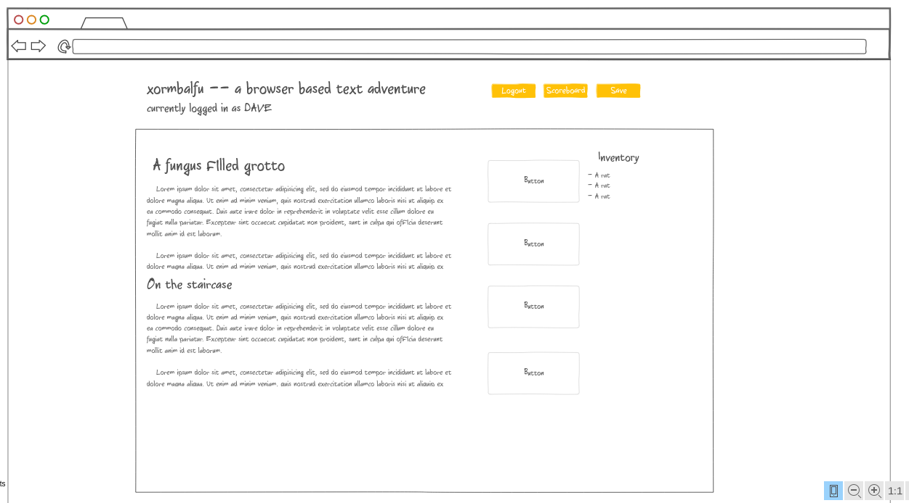
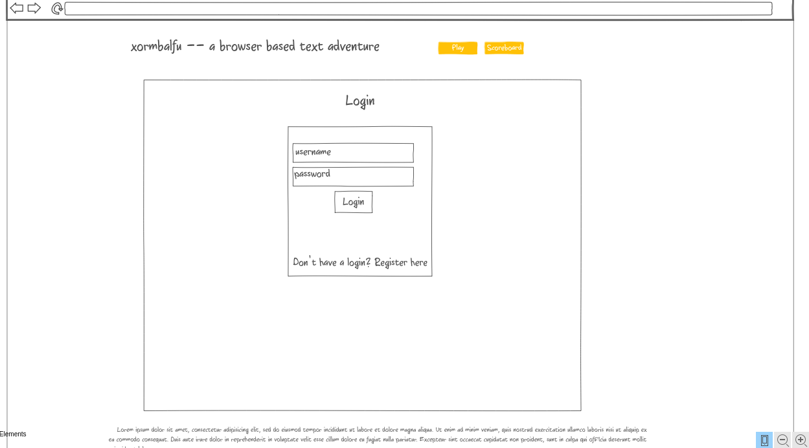
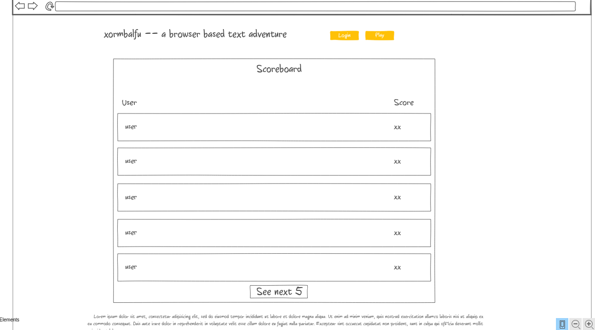

# Startup Specification

## Xormbalfu -- a simple text adventure
Website: [startup.xormbalfu.click](startup.xormbalfu.click)

Xormbalfu is a simple text adventure game focused on exploration and collecting treasure. I'm going to try to make a text parser, but if that doesn't work, input from the user will come from interaction with a series of buttons on the screen, which will expand in scope as the player finds items and equipment. The player explores the ancient alien city of Xormbalfu, trying to retrieve treasure and discover the secrets of the dead city before being eaten by one of the current inhabitants.

The game will feel like a cross between the 1977 text adventure [Zork](https://classicreload.com/zork-i.html) and the 2013 text based RPG [A Dark Room](https://adarkroom.doublespeakgames.com/).

## Key Features
- Secure login
- The ability to persistently save a game and game state
- Ability to play the game within your browser
- Ability to request game information as the user plays
- Ability to save your high scores to a leaderboard

## Sketches
### A sketch showing the game screen with a logged in user:

### A sketch showing the login screen:

### A sketch showing the leaderboard screen with a guest user:

## Technologies
#### Authentication:
Authentication will come from a login screen on the home screen of the app. The user will be able to log in securely through HTTPS and retrieve their game state and score.

#### Database Data:
Xormbalfu will utilize an AWS RDS database that contains the game state for each player as well as top scores for the leaderboard.

#### Websocket Data
The app will receive realtime information from other players when a new top score is set.

## Additional Technologies

#### HTML
The app will have three pages -- a page for the game, a page for high scores, and a page for logging in.

#### CSS
The app will have styling that adapts to different screen sizes, as well as mobile devices.

#### Javascript
Xormbalfu will run off of Javascript in the browser.

## HTML Deliverable
- <b>HTML Page</b> - As part of the HTML deliverable, I created the three pages used in the webapp -- the login page, the high score page, and the home page where you play the game.
- <b>Links</b> - I put in a navigation bar at the top that links between the three pages.
- <b>Application textual content</b> - The home page contains a textual representation of what the game will look like -- text on a screen. It's a text adventure. Yeah. Once I add CSS, it will be in a box by itself with a scroll window, so you can scroll up and see your history in the game, but for now, this is what it would look like with HTML. It also has the input box for commands, and what the inventory will look like. Each item in the inventory will probably have buttons like this with the actions you can use on them.
- <b>Images</b> - I made and added the pixelart logo at the top of the screen. I also made a favicon to use in the tabs, but it won't work. I intentionally didn't put more than that in here, I'm trying to go for a retro feel.
- <b>Login</b> - The login page has boxes for username and password, and a button to submit.
- <b>Database</b> - Each time a command is input from the user, the webapp will pull new descriptions from the database. The high score table will also pull its information from the database.
- <b>Websocket</b> - The count at the bottom of the screen will keep track of the number of logged in users there are at a time (and guest users if I can figure it out).
- <b>Third party service calls</b> - I'm a little lost as to what to do here, but for the present I added a line on the scores page that will pull a random quote from the Kanye Rest API and display it there.

## CSS Deliverable
- <b>Changes</b> - I made some modifications to my website's plan in order to incorporate third party service calls, and so since a scores page didn't make sense, I changed it to an about page. I won't be tracking scores in a database anymore, but I'll still be tracking game saves and user data to satisfy the database requirement. Instead of making my own text adventure, I'm using the OpenAI API to generate one inspired by user input.
- <b>Header, footer, and main content body</b> - As part of the CSS deliverable, I styled the three pages made for the HTML deliverable and defined and styled the main body and footer. Since I'm going for an intentionally minimalist website design, I put everything I needed for the header and footer in just the footer and left the header blank on purpose.
- <b>Navigation elements</b> - I put a Bootstrap nav bar at the bottom of the screen. It will change depending on the size of the screen and contains links to the three webpages as well as a link to my Github.
- <b>Responsive to window resizing</b> - All three pages are responsive to window sizing to one degree or another. For the home page, the main game secion normally has the inventory on the left and the text output in the middle, but at a certain width it changes to be stacked on each other. The about page also change where the text is placed depending on the size of the screen.
- <b>Application elements</b> - I have most of the javascript for the game running already, and all of the CSS/HTML elements I need are there and working. I used flexbox to order and place all of the elements, and some javascript to make elements appear and disappear.
- <b>Application text content</b> - I used consistent fonts and animated the text on the home and about pages.
- <b>Application images</b> - Since this is a minimalist text adventure, the only image in the application is on the about page.

## Javascript Deliverable
- <b>Support for future login</b> - The login page will now store the user's username in local storage on login and redirect them to the home page after a second (to simulate the database connection). After this, the user's username will be displayed on the bottom of each page.
- <b>Support for future database data</b> - The save button on the home page now links to a function that will save the game when database support is introduced. Right now, it just saves the game in localStorage. On page load, the website will call loadGame(), which in the future will load the user's game if they are logged in.